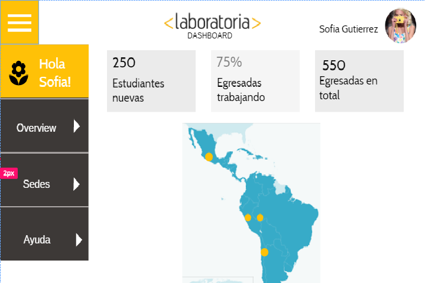
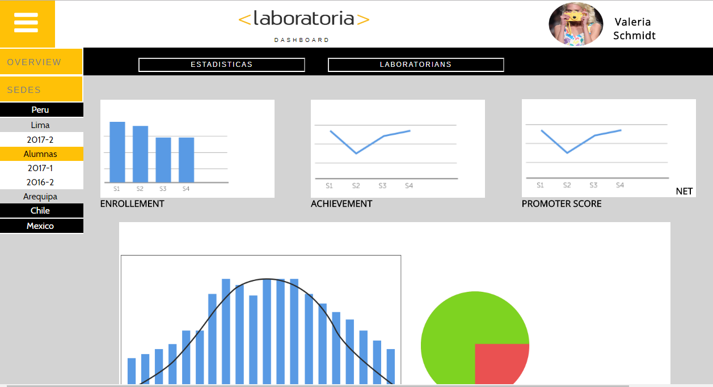

# Data Dashboard

* **Track:** _Common Core_
* **Curso:** _Creando tu primer sitio web interactivo_
* **Unidad:** _Producto final_

***

## Proceso:

### 1. Creando el Sketch en UX Pin

## 2. Maquetando con HTML y dando estilos con CSS

## 3. Agregando funcionalidades con JS

Trabajo realizado por:
1. Ana Lorena Diaz
2. Claudia Zarate